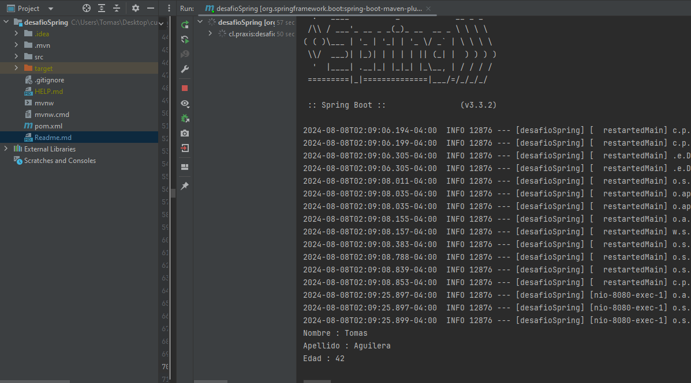
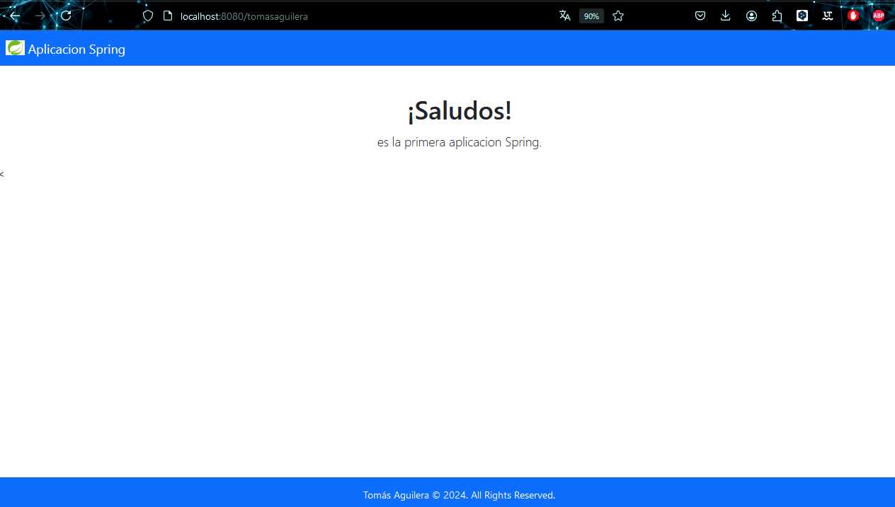

Desafío - Mi primera aplicación web en Spring
--

En este desafío validaremos nuestros conocimientos de creación de proyectos web Spring
Boot. Para lograrlo, necesitarás aplicar previamente todo el material disponible en la unidad
correspondiente.

Lee todo el documento antes de comenzar el desarrollo individual, para asegurarte de tener
el máximo de puntaje y enfocar bien los esfuerzos.

Una vez terminado el desafío, comprime la carpeta que contiene el desarrollo de los
requerimientos solicitados y sube el .zip en el LMS.

Descripción
--

<b>Crear tu primera aplicación web de tipo Spring Boot</b>

Una empresa de desarrollo de software, está solicitando medir las capacidades iniciales
para un puesto de trabajo. Como desafío deberás de mostrar tu primer aplicativo web Spring
Boot donde retorne tu nombre, apellido, y edad. El plus más importante de este aplicativo es
saber mostrar los conocimientos previos sobre la programación orientada a objetos bajo la
arquitectura de Spring.

Para este desafío necesitamos que retornes un Objeto llamado “Persona” por consola
levantando en tu aplicación web los datos solicitados anteriormente. Tal y como se muestra
a continuación:

Requerimientos
--

1. Construir el archivo de configuración pom.xml (2.5 Puntos)

2. Retornar en consola los datos del estudiante. (2.5 Puntos)

3. Añadir las dependencias para iniciar un proyecto de Spring boot (2.5 Puntos)

4. Añadir dependencia PostgreSql (2.5 Puntos)

¡Mucho éxito!

   Consideraciones y recomendaciones
--
   Requerimientos a tener en consideración para implementar:

   ● Crear ruta con su nombre y apellido.

   ● Crear un método que retorne un saludo en pantalla.

   Requerimientos no funcionales a tener en cuenta:

   ● Usar Spring Boot.

   ● Agregar la dependencia PostgreSql. Para futuros trabajos
   

Imagenes del Proyecto Realizado
--

Imagen 1

Imagen 2

